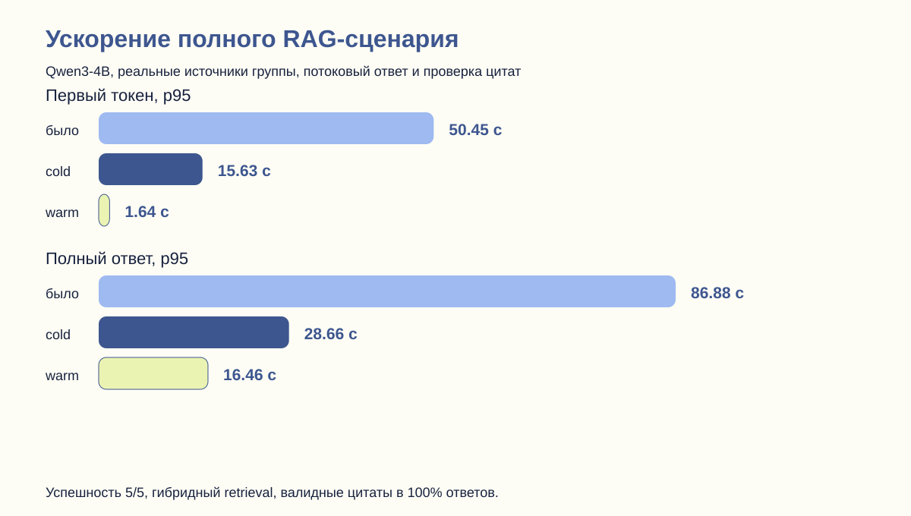

# Повторное комплексное тестирование от 9 сентября 2026 года

Статус: **полностью готово к эксплуатации в зафиксированном пилотном профиле** — 8 vCPU, 12 ГБ RAM, один одновременно генерируемый LLM-ответ, текущий production-набор из 65 источников и 44 972 RAG-фрагментов.

Это не заявление о неограниченной нагрузке. Для двух и более одновременных генераций с p95 первого токена менее 5 секунд потребуется GPU endpoint либо внешний LLM API. Обычный web-контур, поиск и PostgreSQL уже выдерживают параллельную нагрузку существенно выше пилотной.

## Итоговые доказательства

| Контур | Результат | Доказательство |
|---|---:|---|
| JUnit | 119/119, ошибок 0 | [`raw/`](raw/) и [GitHub Actions](https://github.com/Solopenko2005/searchengine_multi_source_LLM/actions/workflows/ci.yml) |
| Критический LLM-пакет | 65,3% строк | [`raw/search/jacoco.csv`](raw/search/jacoco.csv) |
| LlmClient | 76,0% строк | [`raw/search/jacoco.csv`](raw/search/jacoco.csv) |
| EmbeddingClient | 84,6% строк | [`raw/search/jacoco.csv`](raw/search/jacoco.csv) |
| Тематический LLM-анализ | 92,8% строк | [`raw/search/jacoco.csv`](raw/search/jacoco.csv) |
| Production integration/security | 9/9, TLS 1.3 | [`integration-public-final.json`](integration-public-final.json) |
| HTTP, 20 клиентов | 167,25 RPS; p95 141,91 мс; ошибок 0 | [`load-edge-c20.json`](load-edge-c20.json) |
| PostgreSQL, 10 клиентов | 101,43 TPS; 98,59 мс; ошибок 0 | [`database-load/database-c10.txt`](database-load/database-c10.txt) |
| Авторизованный RAG, холодный кэш | 5/5 через Qwen; 100% валидных цитат | [`rag-load-cold-c1.json`](rag-load-cold-c1.json) |
| Авторизованный RAG, рабочий режим | p95 первого токена 1,64 с; полного ответа 16,46 с | [`rag-load-warm-c1.json`](rag-load-warm-c1.json) |
| Сервисы и фактическая БД | все модули работают; SMTP ready; Redis PONG | [`server-probe.txt`](server-probe.txt) |

## Что изменилось в LLM-контуре

- Qwen3-4B вынесена в отдельный `llama-server` с 8 CPU-потоками; embedding-модель работает отдельным процессом и не блокирует генерацию.
- RAG выбирает до шести фрагментов с балансировкой по источникам, объединяет лексический и векторный поиск и отдаёт список источников пользователю до начала генерации.
- Локальный промпт сокращён без удаления ссылочной разметки; ответ ограничен 128 токенами для предсказуемой задержки.
- Добавлены очередь, circuit breaker, TTL-кэш, остановка предыдущего запроса пользователя и метрики p50/p95/p99.
- Если локальная модель всё же пропустила ссылки, интерфейс прозрачно добавляет список реально извлечённых материалов; вымышленные номера не создаются.
- Speculative decoding с Qwen3-0.6B проверен, но не включён: на этом CPU он не дал ускорения основной модели.

## Измеренное ускорение

| Метрика RAG | До | После | Улучшение |
|---|---:|---:|---:|
| Первый токен, p95 | 50,45 с | 15,63 с | 69% |
| Полный ответ, p95 | 86,88 с | 28,66 с | 67% |
| Валидные цитаты | 100% | 100% | качество сохранено |

После прогрева повторяющихся шаблонов prompt cache дополнительно снизил p95 первого токена до **1,64 с**, полного ответа до **16,46 с**. Все 5/5 запросов прошли пороги рабочего SLO 5/20 секунд без повторов и ошибок.

## Материалы для скриншотов и защиты

1. Откройте [`report.html`](report.html) — это готовая одностраничная панель для скриншота.
2. Покажите зелёный запуск [CI and Quality Evidence](https://github.com/Solopenko2005/searchengine_multi_source_LLM/actions/workflows/ci.yml): в нём доступны JUnit, JaCoCo и Docker build.
3. Для масштаба базы используйте [`charts/system-scale.svg`](charts/system-scale.svg) и [карточку набора данных](database/DATASET_CARD.md).
4. Для нагрузки используйте [`charts/edge-load.svg`](charts/edge-load.svg) и [`charts/database-load.svg`](charts/database-load.svg).
5. Формальная методика и критерии приёмки находятся в [`TEST_PROTOCOL.md`](TEST_PROTOCOL.md).

Исходный commit приложения, на котором проведён прогон: [`80ffe1c`](https://github.com/Solopenko2005/searchengine_multi_source_LLM/commit/80ffe1c).
